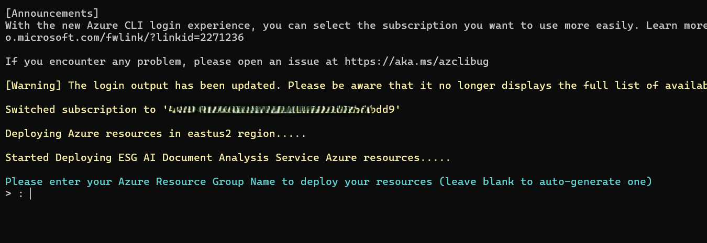
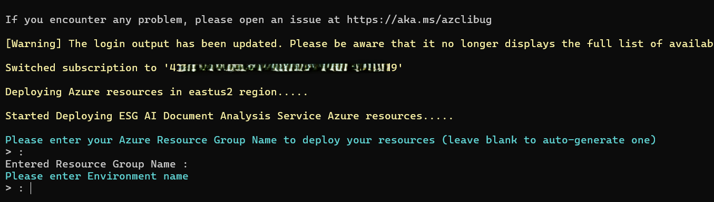

# Deployment Guide for Services

> This repository provides a solution and reference architecture for AI-driven comparative analysis of sustainability reports.  
>  
>  **Note:** The provided code is for demonstration purposes only and is not an officially supported Microsoft product.  
>  
> For improved security, consider integrating [Azure API Management with microservices deployed in Azure Kubernetes Service (AKS)](https://learn.microsoft.com/en-us/azure/api-management/api-management-kubernetes).

---

## Contents

- [Prerequisites](#prerequisites)  
- [Regional Availability](#regional-availability)  
- [Deploy to Azure](#deploy-to-azure)  
- [Post-Deploy Configuration](#post-deploy-configuration)  
- [Troubleshooting](#troubleshooting)  
- [Next Steps](#next-steps)  
  - [Test APIs](./docs/TestApis.md)  
  - [Deploy Power Platform Client](./DeployPowerPlatformClient.md)  

---

## ✅ Prerequisites

Before deploying the solution, ensure you have the following tools and access in place:

1.  **[Git](https://git-scm.com/downloads)**  
  Required to clone the project repository.

2.  **[PowerShell (v5.1+)](https://learn.microsoft.com/en-us/powershell/scripting/install/installing-powershell)**  
  Script execution environment, available on Windows, macOS, and Linux.

3.  **[Azure CLI (v2.0+)](https://learn.microsoft.com/en-us/cli/azure/install-azure-cli)**  
  Command-line tool to manage Azure resources.

  - **kubectl** – CLI for interacting with Kubernetes clusters.  
    Install via PowerShell:
    ```powershell
    az aks install-cli
    ```

  - **aks-preview** – Azure CLI extension to enable AKS advanced features.  
    Install via PowerShell:
    ```powershell
    az extension add --name aks-preview
    ```

4.  **[Helm](https://helm.sh/docs/intro/install/)**  
  Kubernetes package manager used for deploying services.

5.  **[Docker Desktop](https://docs.docker.com/get-docker/)**  
  Required to containerize applications and publish to Azure Container Registry.  
  >💡 Make sure Docker Desktop is running before executing deployment scripts.

6.  **Azure Access**  
  You must have a **subscription-level** role of either:  
  - `Owner` or  
  - `User Access Administrator`

---

## Regional Availability

*Some services in this solution are restricted to specific Azure regions due to model availability.*

- **Azure OpenAI (Sweden Central)**  
  This solution uses `gpt-4o`, `gpt-4-32k`, and `text-embedding-3-large`, which are currently available in the **Sweden Central** region.  
  Refer to the [model availability table](https://learn.microsoft.com/en-us/azure/ai-services/openai/concepts/models#model-summary-table-and-region-availability) for the latest info.

- **Azure AI Document Intelligence (East US)**  
  Requires API version `2023-10-31-preview` or later, currently available in **East US**.  
  For more details, see the [troubleshooting guide](./TROUBLESHOOTING.md).


## Deploy to Azure

The automated deployment process is streamlined and easy to use, executed through a single [deployment script](./scripts/deployAzureResources.ps1) that completes in roughly 10–15 minutes.

### Automated Deployment Steps:
1. Deploy Azure resources.
2. Get secret information from Azure resources.
3. Update application configuration files with secrets.
4. Compile application, build image, and push to Azure Container Registry.
5. Configure Kubernetes cluster infrastructure.
6. Update Kubernetes configuration files.
7. Deploy certificates, ingress controller, and application service images.
8. Deploy and integrate Power Platform.


## Step 1 Run Deployment:
### Step 1.1 Clone the repository

Before starting the deployment, clone the project repository to your local machine.

1. **Open your terminal or command prompt**  
   (On Windows, you can use Command Prompt or Git Bash. On Mac/Linux, use Terminal.)

2. **Navigate to the folder where you want to save the project**  
   Example:
   ```bash
   cd Documents
3. **Run the following command to clone the repository**
    ```bash
    git clone https://github.com/microsoft/Comparative-Analysis-for-Sustainability-Solution-Accelerator.git
4. **Move into the project folder**
    ```bash
    cd Comparative-Analysis-for-Sustainability-Solution-Accelerator
### Step 1.2 Run Deployment Script 
Once the repository is cloned, follow these steps to deploy the required Azure resources:
1. Open PowerShell, change directory to script location
```powershell
    cd .\Deployment\scripts\
```
2. Run the deployment script 
```powershell
    .\deployAzureResources.ps1
```
>Note: If you encounter an error about the script not being digitally signed, you can use the following command instead:
```
powershell.exe -ExecutionPolicy Bypass -File ".\deployAzureResources.ps1"
```
3. Enter Required Parameters

    When you run the deployment script, you will be prompted to provide the following parameters:
    
    +  **Subscription ID** - Your Azure Subscription ID (copy/paste from the Azure portal).

    +  **Environment Name** - A unique environment name (e.g., dev, test, prod).This is used to scope resource names and group deployments logically.
    
    +  **Resource Group Name** - The Azure resource group to deploy resources into.You may either:
    
       - Specify an existing resource group to reuse it, [see below](#configuring-a-new-or-existing-resource-group) for more details, or
       - Leave blank to auto-generate a new name.
   
   +    **Location** - Azure data center where resources will be deployed. Please [check Azure resource availability and note hardcoded regions](#regional-availability). The following locations are currently supported: 
        
        ```
        'EastUS', 'EastUS2', 'WestUS', 'WestUS2', 'WestUS3', 'CentralUS', 'NorthCentralUS', 'SouthCentralUS','WestEurope', 'NorthEurope', 'SoutheastAsia', 'EastAsia', 'JapanEast', 'JapanWest', 'AustraliaEast', 'AustraliaSoutheast', 'CentralIndia', 'SouthIndia', 'CanadaCentral','CanadaEast', 'UKSouth', 'UKWest', 'FranceCentral', 'FranceSouth', 'KoreaCentral','KoreaSouth', 'GermanyWestCentral', 'GermanyNorth', 'NorwayWest', 'NorwayEast', 'SwitzerlandNorth', 'SwitzerlandWest', 'UAENorth', 'UAECentral', 'SouthAfricaNorth','SouthAfricaWest', 'BrazilSouth','BrazilSoutheast', 'QatarCentral', 'ChinaNorth', 'ChinaEast', 'ChinaNorth2', 'ChinaEast2'
        ```
     + **Email** - used for issuing certificates in Kubernetes clusters Via [Let's Encrypt](https://letsencrypt.org/) service. 
        ><span style="color:green">Note: Use a valid email that is the same email used to set up your identity in your target Azure Tenant.</span>
    
     + **IP Range Allow-list** - This is used to restrict access to the API service endpoints. To enable the front end cloud flows to access the service, you will need to add the [Power Automate (Azure Logic Apps) outbound IP addresses](https://learn.microsoft.com/en-us/azure/logic-apps/logic-apps-limits-and-config?tabs=consumption#outbound-ip-addresses) for the region your flows are deployed, in CIDR notation. For example, if your Power environment is in the US region, you will need to allow the outbound Azure Logic App IPs for all US sub-regions:

        ```
        13.67.236.125/32, 104.208.25.27/32, 40.122.170.198/32, 40.113.218.230/32, 23.100.86.139/32, 23.100.87.24/32, 23.100.87.56/32, 23.100.82.16/32, 52.141.221.6/32, 52.141.218.55/32, 20.109.202.36/32, 20.109.202.29/32, 13.92.98.111/32, 40.121.91.41/32, 40.114.82.191/32, 23.101.139.153/32, 23.100.29.190/32, 23.101.136.201/32, 104.45.153.81/32, 23.101.132.208/32, 52.226.216.197/32, 52.226.216.187/32, 40.76.151.25/32, 40.76.148.50/32, 20.84.29.29/32, 20.84.29.18/32, 40.76.174.83/32, 40.76.174.39/32, 4.156.27.7/32, 4.156.28.117/32, 4.156.25.188/32, 20.242.168.24/32, 4.156.241.165/32, 4.156.243.170/32, 4.156.242.49/32, 4.156.243.164/32, 52.224.145.30/32, 4.156.242.92/32, 4.156.243.172/32, 4.156.241.191/32, 4.156.241.47/32, 4.156.241.229/32, 4.156.242.12/32, 172.212.32.196/32, 40.84.30.147/32, 104.208.155.200/32, 104.208.158.174/32, 104.208.140.40/32, 40.70.131.151/32, 40.70.29.214/32, 40.70.26.154/32, 40.70.27.236/32, 20.96.58.140/32, 20.96.58.139/32, 20.96.89.54/32, 20.96.89.48/32, 20.96.89.254/32, 20.96.89.234/32, 20.122.237.189/32, 52.253.79.47/32, 20.122.237.225/32, 20.122.237.205/32, 4.152.128.227/32, 4.152.128.205/32, 4.153.159.226/32, 4.152.129.221/32, 4.152.127.229/32, 4.152.125.62/32, 4.153.194.246/32, 4.153.201.239/32, 168.62.248.37/32, 157.55.210.61/32, 157.55.212.238/32, 52.162.208.216/32, 52.162.213.231/32, 65.52.10.183/32, 65.52.9.96/32, 65.52.8.225/32, 52.162.177.90/32, 52.162.177.30/32, 23.101.160.111/32, 23.101.167.207/32, 20.80.33.190/32, 20.88.47.77/32, 172.183.51.180/32, 40.116.65.125/32, 20.88.51.31/32, 40.116.66.226/32, 40.116.64.218/32, 20.88.55.77/32, 172.183.49.208/32, 20.102.251.70/32, 20.102.255.252/32, 20.88.49.23/32, 172.183.50.30/32, 20.88.49.21/32, 20.102.255.209/32, 172.183.48.255/32, 104.210.144.48/32, 13.65.82.17/32, 13.66.52.232/32, 23.100.124.84/32, 70.37.54.122/32, 70.37.50.6/32, 23.100.127.172/32, 23.101.183.225/32, 20.94.150.220/32, 20.94.149.199/32, 20.88.209.97/32, 20.88.209.88/32, 172.206.187.57/32, 172.206.187.90/32, 172.206.187.98/32, 172.206.187.132/32, 52.255.124.118/32, 52.255.127.125/32, 52.255.126.229/32, 52.255.127.233/32, 52.161.27.190/32, 52.161.18.218/32, 52.161.9.108/32, 13.78.151.161/32, 13.78.137.179/32, 13.78.148.140/32, 13.78.129.20/32, 13.78.141.75/32, 13.71.199.128/27, 13.78.212.163/32, 13.77.220.134/32, 13.78.200.233/32, 13.77.219.128/32, 52.150.226.148/32, 4.255.161.16/32, 4.255.195.186/32, 4.255.168.251/32, 4.255.219.152/32, 20.165.235.148/32, 20.165.249.200/32, 20.165.232.68/32, 52.160.92.112/32, 40.118.244.241/32, 40.118.241.243/32, 157.56.162.53/32, 157.56.167.147/32, 104.42.49.145/32, 40.83.164.80/32, 104.42.38.32/32, 13.86.223.0/32, 13.86.223.1/32, 13.86.223.2/32, 13.86.223.3/32, 13.86.223.4/32, 13.86.223.5/32, 104.40.34.169/32, 104.40.32.148/32, 52.160.70.221/32, 52.160.70.105/32, 13.91.81.221/32, 13.64.231.196/32, 13.87.204.182/32, 40.78.65.193/32, 13.87.207.39/32, 104.42.44.28/32, 40.83.134.97/32, 40.78.65.112/32, 168.62.9.74/32, 168.62.28.191/32, 13.91.81.188/32, 13.88.169.213/32, 13.64.224.17/32, 13.91.70.215/32, 13.83.14.75/32, 13.91.231.159/32, 13.91.102.122/32, 52.160.94.54/32, 13.91.17.147/32, 13.93.163.29/32, 13.93.223.133/32, 13.88.19.4/32, 13.91.33.16/32, 13.91.247.124/32, 52.160.39.166/32, 13.91.20.94/32, 13.93.180.161/32, 13.93.161.57/32, 13.93.183.170/32, 13.93.180.221/32, 13.64.236.222/32, 13.64.237.74/32, 13.93.203.72/32, 13.88.56.138/32, 13.93.239.25/32, 13.83.10.112/32, 13.64.241.219/32, 13.64.243.209/32, 104.42.134.185/32, 40.112.138.23/32, 104.42.226.197/32, 104.42.129.159/32, 13.91.87.195/32, 13.93.167.155/32, 13.91.46.132/32, 13.91.247.104/32, 13.66.210.167/32, 52.183.30.169/32, 52.183.29.132/32, 13.66.201.169/32, 13.77.149.159/32, 52.175.198.132/32, 13.66.246.219/32, 20.99.189.158/32, 20.99.189.70/32, 20.72.244.58/32, 20.72.243.225/32, 4.155.162.242/32, 172.179.145.85/32, 4.155.163.91/32, 4.155.160.115/32, 4.149.67.227/32, 172.179.155.210/32, 4.149.68.65/32, 4.149.68.107/32, 20.150.181.32/32, 20.150.181.33/32, 20.150.181.34/32, 20.150.181.35/32, 20.150.181.36/32, 20.150.181.37/32, 20.150.181.38/32, 20.150.173.192/32, 20.106.85.228/32, 20.150.159.163/32, 20.106.116.207/32, 20.106.116.186/32, 4.227.74.141/32, 4.227.76.10/32, 4.236.45.223/32, 4.236.55.86/32, 4.227.76.180/32, 4.227.77.218/32, 4.227.77.116/32, 4.227.78.222/32
        ```

         You must also add your own IP address if you would like to [test the API services](./docs/TestApis.md) using Postman after deployment. You can also [update the IP allowlist after deployment](./docs/UpdateIPAllowlist.md) if needed.


>**IMPORTANT SECURITY NOTE:** The API service endpoints can only be accessed from client apps with IPs that are white listed which you defined when running this script. After deployment, you will need to implement additional API security to prevent unauthorized use. It is advised to monitor access and scan system logs to detect unusual patterns.

 ## Configuring a New or Existing Resource Group 
   
  When configuring your deployment, you have the option to use either a new or an existing Azure resource group. Please follow the instructions below based on your selection:

  - **Creating a New Resource Group**  :  You can create a new resource group in one of the following two ways:

      - Manually specify the name of the new resource group.
                Example: rg-esgdocanalysis

      - Leave the input field blank and press Enter. A new resource group name will be automatically generated.

  - **Using an Existing Resource Group** : If you prefer to use an existing resource group, please ensure that:

      - You enter the exact name of the existing resource group.

      - You provide the same environment name that was used previously with this resource group.

  This ensures consistency and avoids configuration conflicts during deployment.

  ⚠️ After deployment, please restart the AKS (Kubernetes) service to ensure updated configurations are applied when using a reused resource group.




### Step 1.3 
Copy and save the API Service Endpoint from the deployment output for further steps.:<br></br>
    
 
## Step 2 Post-Deploy Configuration

The following integrations require manual configuration and cannot be fully automated.

1. [Configure Microsoft Teams](#configure-microsoft-teams)
2. [Configure Teams API Connection](#configure-teams-api-connection)
3. [Configure Logic App Actions](#configure-logic-app-actions)
4. [Configure Logic App HTTP Call](#configure-logic-app-http-call)
5. [Configure Azure OpenAI Rate Limits](#configure-azure-openai-rate-limits)


### Step 2.1 Configure Microsoft Teams

If required, create a dedicated Teams channel for the IT team to receive notifications. Since all document registration, processing, analysis, and generation are handled asynchronously, the solution sends status updates to the Teams channel to support ongoing monitoring.

1. Click `Teams > Add Channel` from left sidebar:<br>
    

1. Create new channel to recieve status updates:<br>
    


### Step 2.2 Configure Teams API Connection
To access Teams from Logic Apps, we need to authorization a connection.

1. Navigate to the deployed resource group in the Azure Portal, then select the ` teams ` resource from the list.<br>
    

1. Click `Authorize` on the `General > Edit API connection` page:<br>
    

1. You will get a login flow to authorize connection:<br>
    

1. Once successfully logged in, click `Save` buton.


### Step 2.3 Configure Logic App Actions
**Note: This step must be taken in all 3 deployed Logic Apps>**
* logicapp-benchmarkprocesswatcher{*}
* logicapp-docregistprocesswatcher{*}
* logicapp-gapanalysisprocesswatcher{*}

1. Within each Logic App, open the `Logic app designer`:<br>
    

2. Select the Teams actions to update Channel information:<br><br>
    Set Team:<br>
    <br>

    Set Channel:<br>
    


### Step 2.4 Configure Logic App HTTP Call

1. Copy the `API Service Endpoint` from the deployment script summary:<br>
    
1. Open the Logic App named `logicapp-docregistprocesswatcher{*}`
1. Select and click `HTTP` action, which has the text `HTTP` next to a green logo. 
1. Paste URL replacing only `[...]` prefix and preserving API path:<br>
    <br>
    


### Step 2.5 Configure Azure OpenAI Rate Limits

> **Capacity Note:**
> * The deployment script creates models using the minimum tokens per minute (TPM) rate limit.
> * Faster performance can be achieved by increasing the TPM limit with Azure OpenAI Foundry.
> * If capacity is too low, you may experience timeout errors.
> * Capacity varies for [regional quota limits](https://learn.microsoft.com/en-us/azure/ai-services/openai/quotas-limits#regional-quota-limits) as well as for [provisioned throughput](https://learn.microsoft.com/en-us/azure/ai-services/openai/concepts/provisioned-throughput).

1. Browse to Azure OpenAI Foundry and select **each of the 3 models** within the `Deployments` menu:
      

1. Increase the TPM value for **each of the 3 models** for faster report generation:  
    

## Troubleshooting

If you experienced any issues during deployment, please review the [troubleshooting guide](./TROUBLESHOOTING.md).

## Next Steps

### 🥳🎉 First, congrats on finishing backend deployment!

* [Test backend APIs](./docs/TestApis.md)
* [Deploy Power Platform Client and set up Client integration with Services](./DeployPowerPlatformClient.md)

