# Troubleshooting

Sometimes your PowerShell script execution can be blocked by your company policy.  
You have to make sure your current Powershell Execution Policy with cmdlet :
``` powershell
    Get-ExecutionPolicy
```

## [Optional] Monitoring Services
If you are developer and want to take a monitor the pods per ai-service and kernelmemory service in Kubernetes, recommend to use [Kubernetes addon for vscode](https://code.visualstudio.com/docs/azure/kubernetes).

## Testing APIs
Before integration with Presentation layer(PowerApps), you can test the APIs with [Postman](https://www.postman.com/downloads/).  
(the scripts are in the  [postman](.\postman) folder under deployment)

Each API tests should start after finishing all configuration steps.

Before Creating Request to API, please make sure you set up your environment with deployed API URL.

- 1. Document Registration  
Let's start to test with [Microsoft EnvironmentalSustainability Report](https://query.prod.cms.rt.microsoft.com/cms/api/am/binary/RW1lMjE).  
Download the file and Set file location in Postman - RegisterDocument request.    

     Set file location and update tag information.   
     Tag information can be key value collection. key name can be duplicated.
 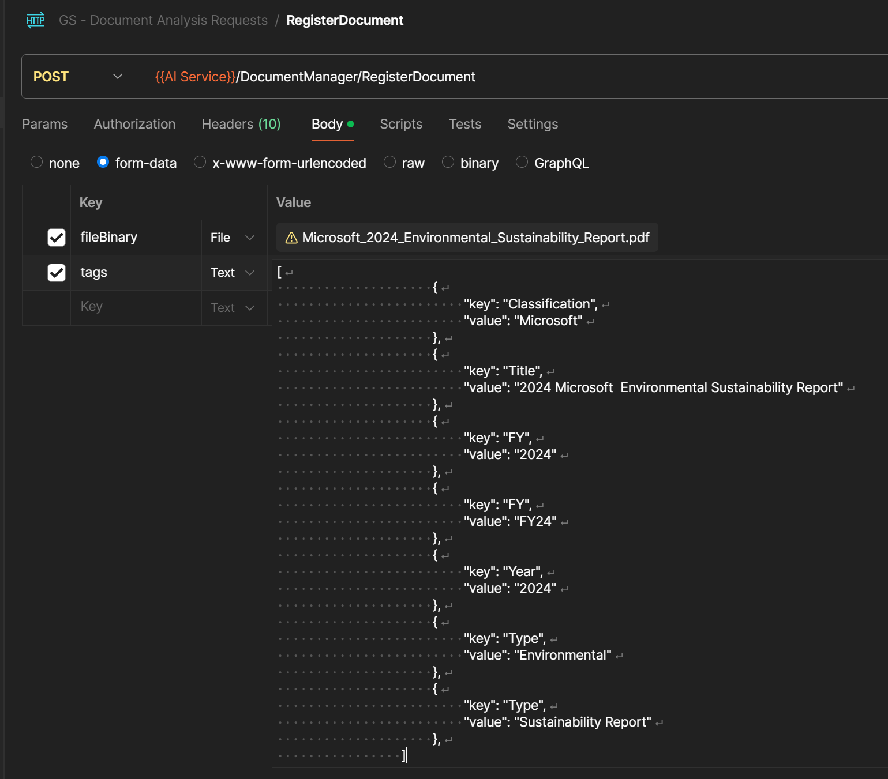  
 Once you submit the request to API, you might get the response with 202 Accepted.  
 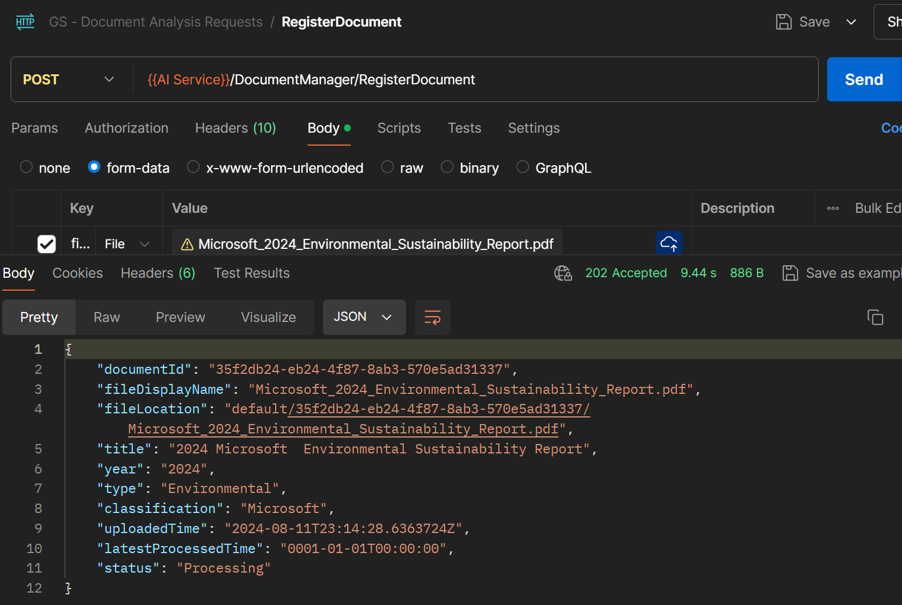  
 Every document will be managed with its own identical **documentid**.  
 The document registration process takes a time based on its content length. the kernel memory document processing service takes multiple document process for RAG processing by ai-service.
 Check Location Header value in Headers. it shows the url for monitoring document processing status. The logic app for Document processing watcher is checking its status but you may check its status by manually with this information.
 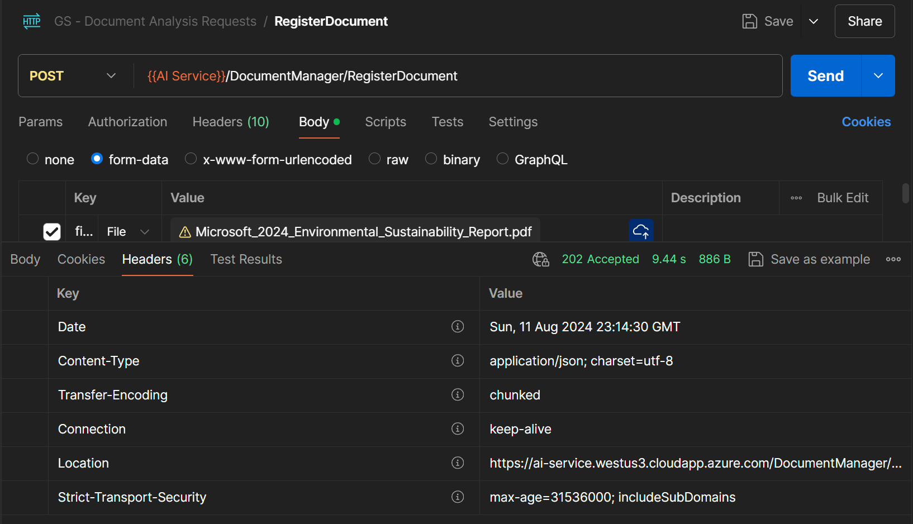
 Once document registration process has been completed, you will get the notification from teams message.
 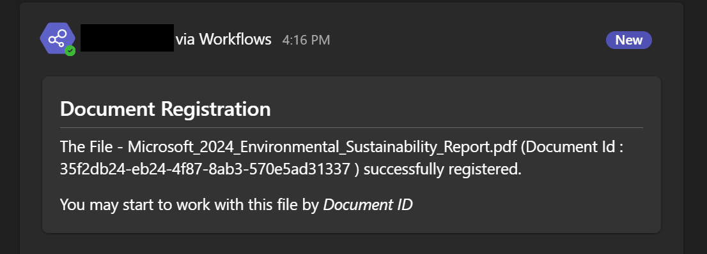  
 You may check the file registration process with location url like below :
   ```json
     {
        "completed": true,
        "failed": false,
        "empty": false,
        "index": "default",
        "document_id": "35f2db24-eb24-4f87-8ab3-570e5ad31337",
        "tags": {
            "Classification": [
                "Microsoft"
            ],
            "Title": [
                "2024 Microsoft  Environmental Sustainability Report"
            ],
            "FY": [
                "2024",
                "FY24"
            ],
            "Year": [
                "2024"
            ],
            "Type": [
                "Environmental",
                "Sustainability Report"
            ]
        },
        "creation": "2024-08-11T23:14:28.9411842+00:00",
        "last_update": "2024-08-11T23:15:44.4158046+00:00",
        "steps": [
            "extract",
            "partition",
            "gen_embeddings",
            "save_records"
        ],
        "remaining_steps": [],
        "completed_steps": [
            "extract",
            "partition",
            "gen_embeddings",
            "save_records"
        ]
    }
   ```

- 2. Ask about Document  
You can make any questions about registered document with registered document id  
        ``` 
        - Summarize this document  
        - Show me the total Scope 3 emissions
        - Which Scope emissions is main contributor for Microsoft's carbon emission?
        ```
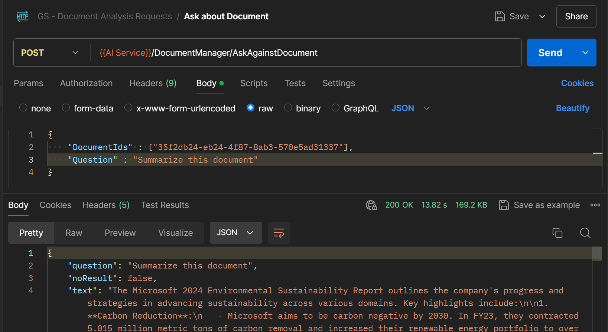
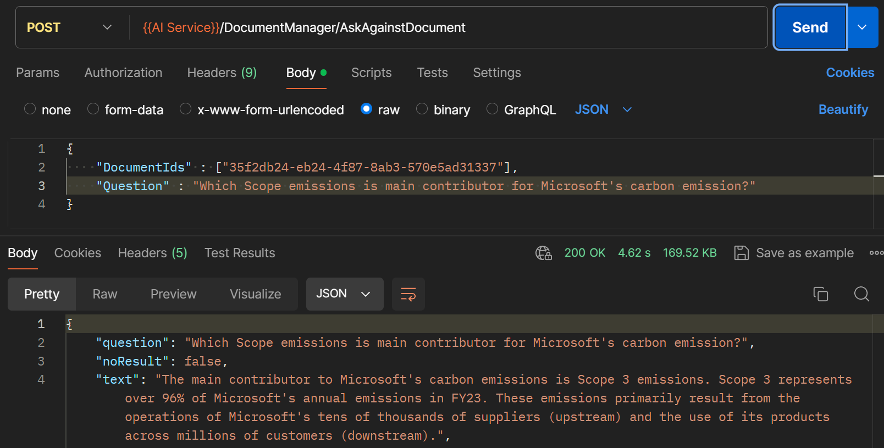

- 3. Generate Benchmark Report  
To generating Benchmark report, we need to register 4 documents. (for example : Microsoft and competitors - [Google](https://www.gstatic.com/gumdrop/sustainability/google-2024-environmental-report.pdf), [Amazon](https://sustainability.aboutamazon.com/2023-sustainability-report.pdf), [Apple](https://www.apple.com/environment/pdf/Apple_Environmental_Progress_Report_2024.pdf))    


        - 3.1 - Take a document registration process with each company's sustainability report document.  
After document registration process per each documents, update document ids with Microsoft and other 3 documents.  
Now We are going to generate benchmark report with CSRD disclosure for E1-1 14.  
We can change its disclosure requirements with any CSRD qualitative disclosure requirements.  
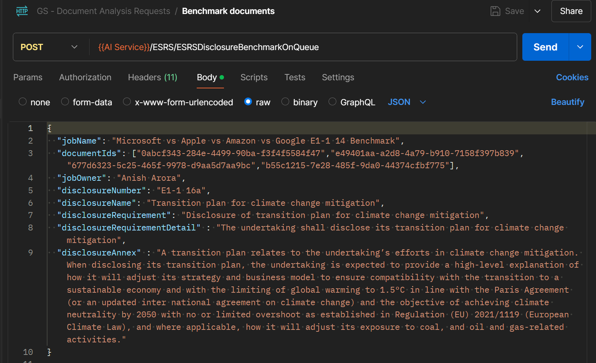  
        - 3.2 - Submit the request.
                You may get the response immediately with this reponse with 202 Accepted headers.
                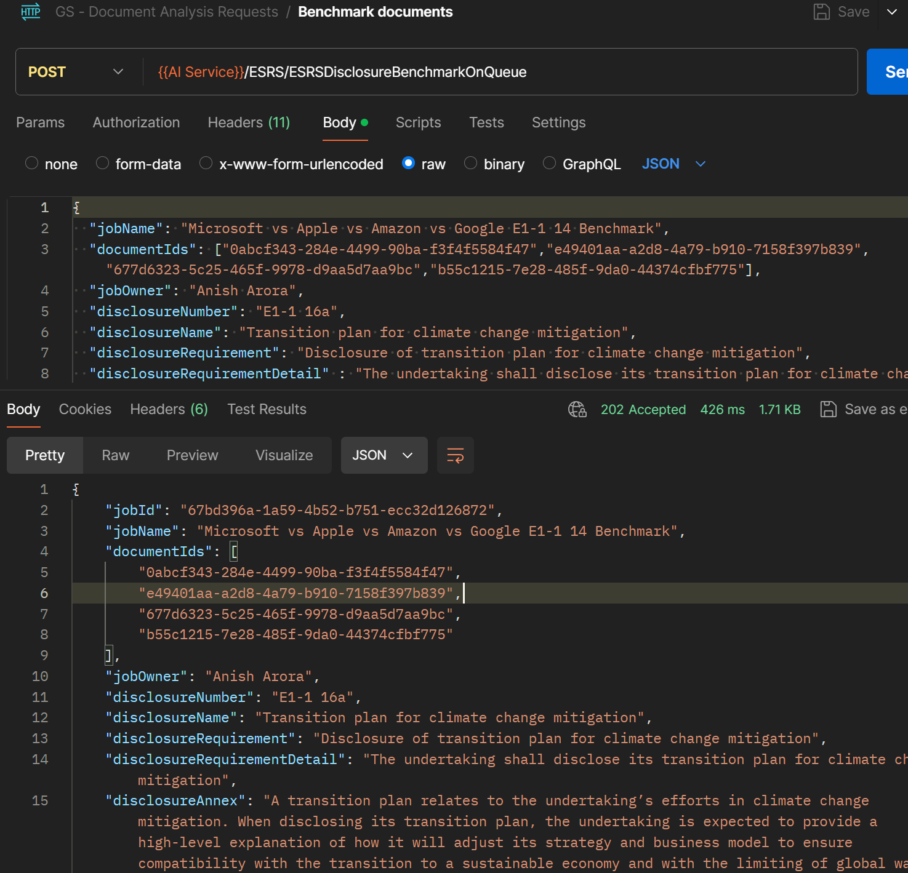  
                After 5 or 7 mins (it's depends on your token rate per minutes), you can get the notification through teams message.
                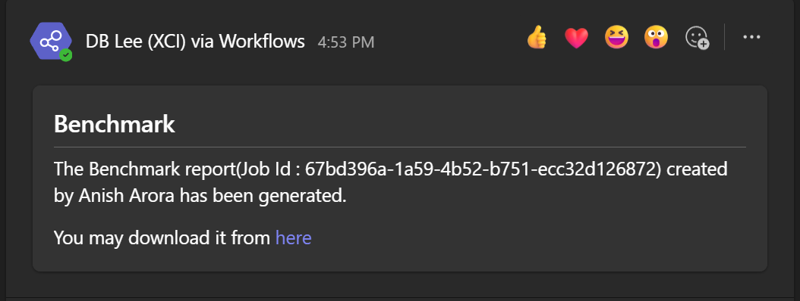  
                or you may check the location url from Headers. 
                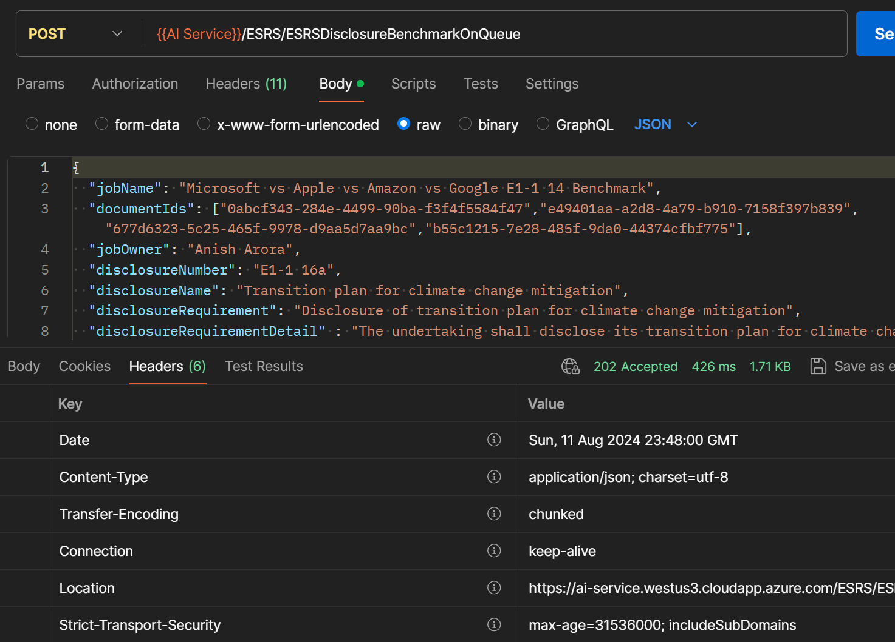  

        You may check the generated report with a link in a team message or benchmarkResultHtmlFileUrl value in the status location url's response json.
        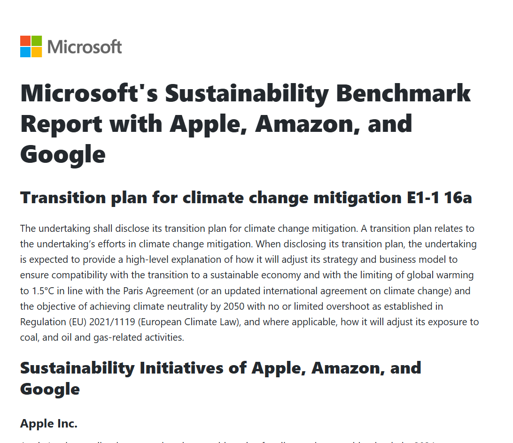

- 4. Generate GapAnalysis Report
      We are going to use Microsoft environmental sustainability report for generating GapAnalysis report.  
      Update document Id in Body json message then submit the request.
      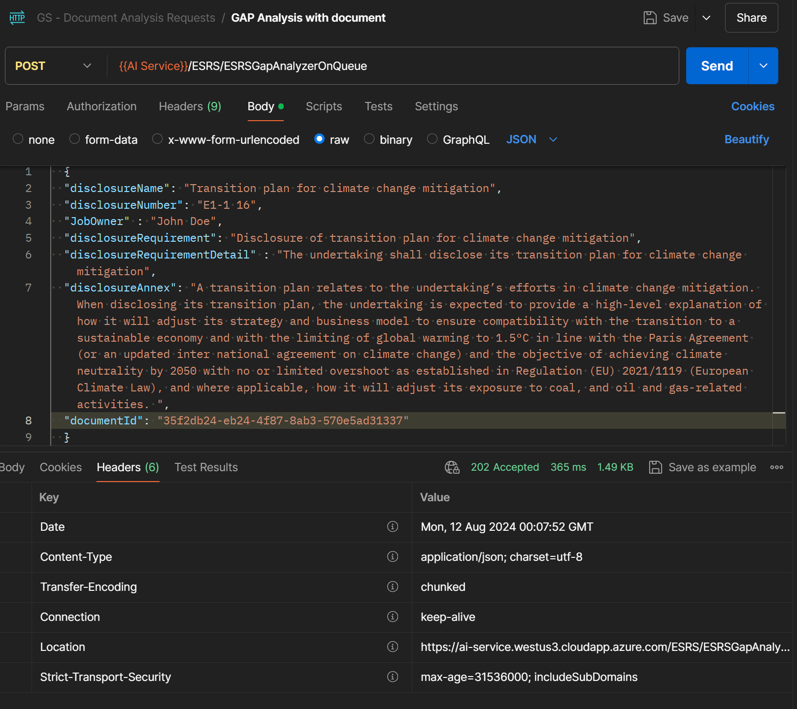  
      After 2 or 3 mins, you may get the notification message via Teams or you may manually check the process status with location url in Header response.
      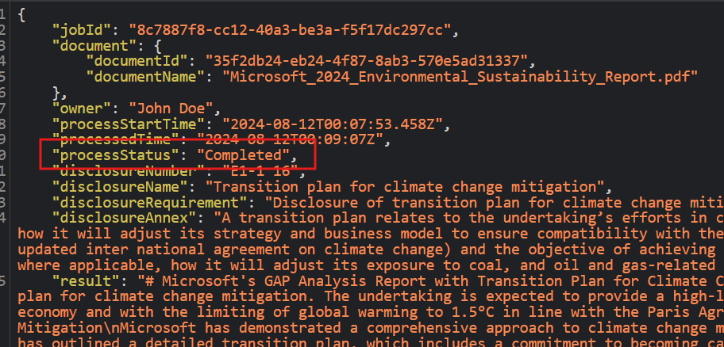  

    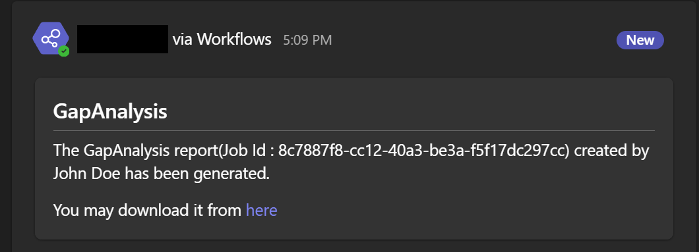  

    You may check the generated GapAnalysis report like this  
    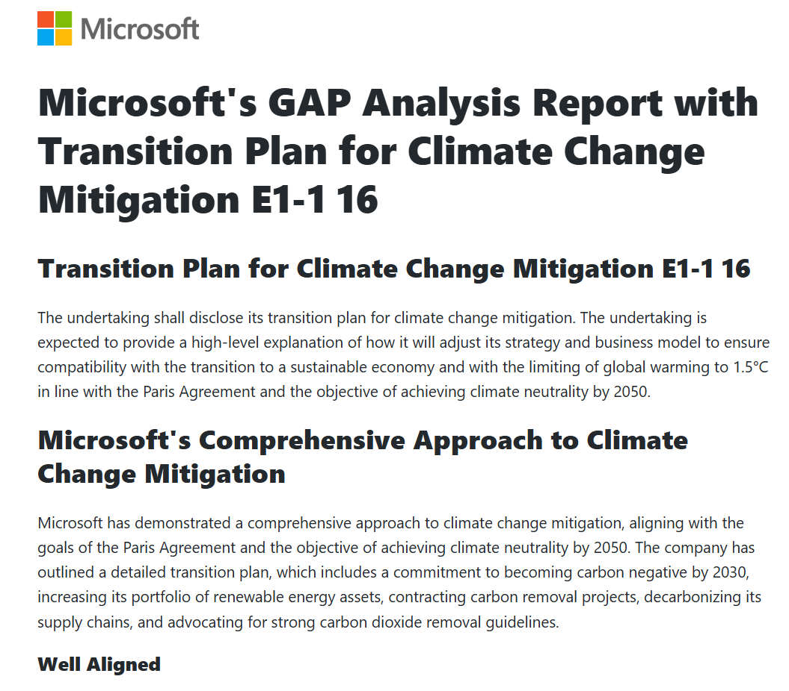

## Change Code and Publish
Use [buildandpublishcodes.ps1](buildandpushcodes.ps1) file.  

```Powershell
# AI-Service Build and push the container image to Azure Container Registry
# Unmark this code and run it in the terminal
# docker build ..\src\ESG-AI-Doc-Analysis\source\. --no-cache -t [Your Container Registry Name].azurecr.io/esg-ai-docanalysis/aiservice
# docker push [Your Container Registry Name].azurecr.io/esg-ai-docanalysis/aiservice

# KernelMemory Build and push the container image to Azure Container Registry
# Unmark this code and run it in the terminal
# docker build ..\src\kernel-memory\. --no-cache -t -t [Your Container Registry Name].azurecr.io/esg-ai-docanalysis/kernelmemory
# dockeer push [Your Container Registry Name].azurecr.io/esg-ai-docanalysis/kernelmemory

# Rollout and Restart the Azure Kubernetes Service for the changes to take effect
# Unmark this code and run it in the terminal for your Azure Kubernetes Service
# kubectl rollout restart deployment aiservice-deployment
# kubectl rollout restart deployment kernelmemory-deployment
```

Intentionally all codes are remarked.  
After updating **[Your Container Registry Name]** which is your deployed Container Registry Name, unmark the lines for docker build for aiservice or kernelmemory.  
it will compile and make a new image then push your container registry.  
If you want to rollout and restart with update image, please unmark Rollout lines for aiservice or kernelmemory.

## Build and Push
See `sample_buildandpush.ps1`

## Azure Document Intelligence
We are using the Azure AI Document Intelligence `2023-10-31-preview` model for PDF parsing process and converting documents to Markdown-formatted string.

If you want to change the model's location to other data centers (West US2 or West Europe), you can update the configuration and redeploy the services on Azure container service.

#### Learn More
* [Document processing models](https://learn.microsoft.com/en-us/azure/ai-services/document-intelligence/concept-model-overview)
* [Newly setup Document Intelligence endpoint returns 404](https://learn.microsoft.com/en-us/answers/questions/1702660/newly-setup-document-intelligence-endpoint-returns)
