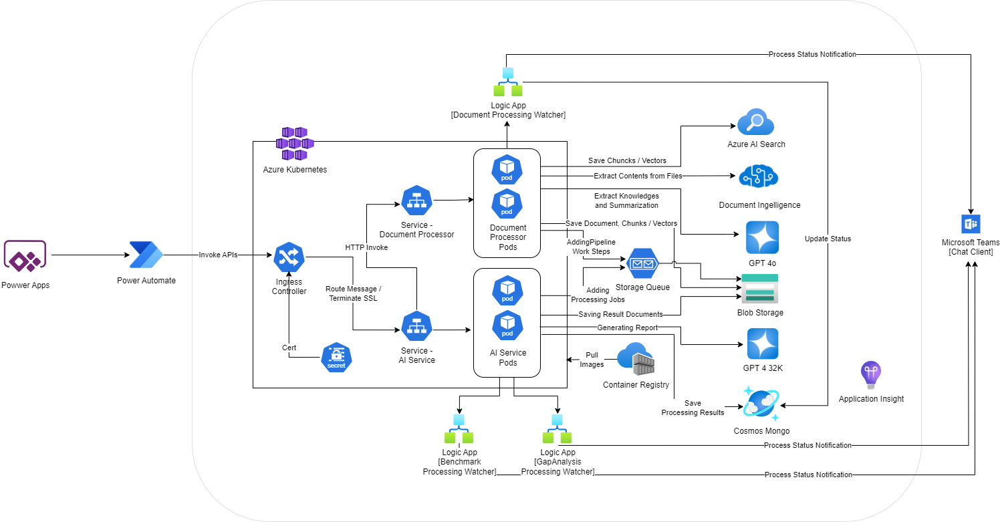

# Architecture Description - Services Only
The architecture diagram illustrated on this page is focused on the Services provided in Azure. The services are REST API services that can be called by client programs such as Power Apps. If your organization prefers to use other client programs such as a web application, you can deploy the services only and integrate with your preferred client program. You will need to add a security layer for the services based on your own company's security requirements. 

Please read the [Security Page](./Security.md) for more information.  

