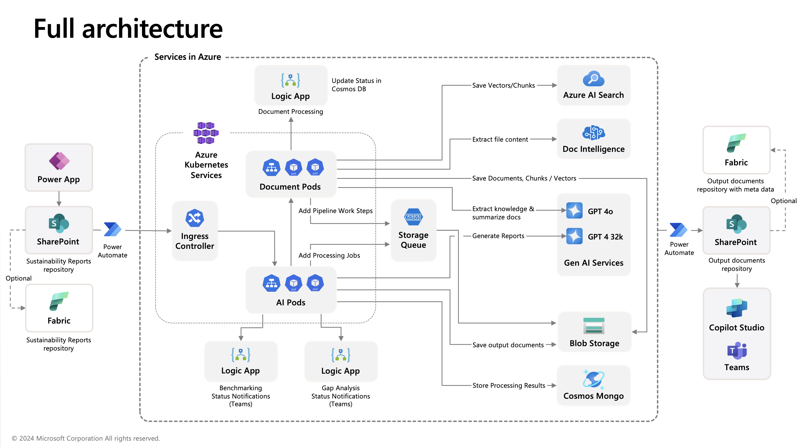
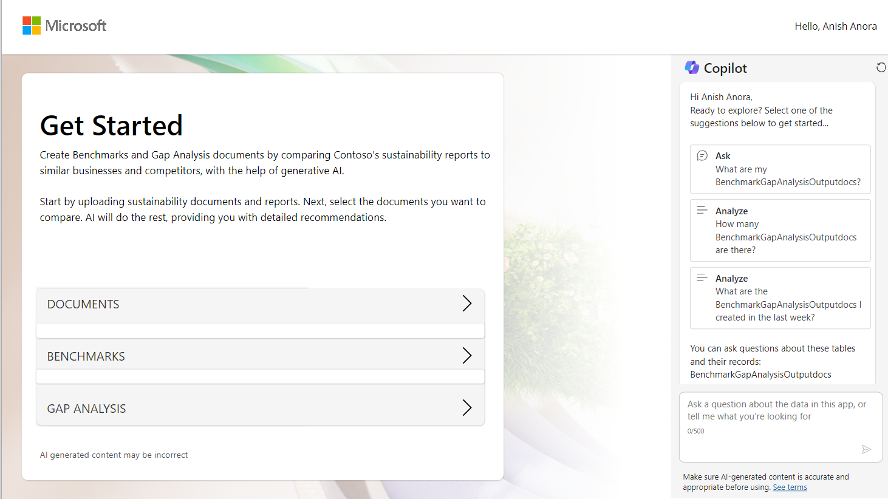

# Comparative Analysis for Sustainability

This solution accelerator enables companies to advance sustainability initiatives with precision by using AI to compare company's reports to peers, benchmark them against industry standards, and quickly create a plan of action. Compliance standards applied: Corporate Sustainability Reporting Directive ([CSRD](https://finance.ec.europa.eu/capital-markets-union-and-financial-markets/company-reporting-and-auditing/company-reporting/corporate-sustainability-reporting_en)) and Global Reporting Initiatives ([GRI](https://www.globalreporting.org/standards)). 

 

[**SOLUTION OVERVIEW**](#solution-overview)  \| [**QUICK DEPLOY**](#quick-deploy)  \| [**BUSINESS USE CASE**](#business-use-case)  \| [**SUPPORTING DOCUMENTATION**](#supporting-documentation)

 

<h2>
Solution overview
</h2>

This solution accelerator enables companies to detect compliance gaps, benchmark against their peers, and generate action plans to ensure they’re on track to meet their sustainability goals. Leveraging the simplicity of PowerApps, users can easily upload documents and generate gap analyses and benchmarking reports for GRI and CSRD indicators. An AI-generated report is then created, which provides a brief summary of the company’s (and their peer’s) performance, similarities/dissimilarities, and an action plan for improvement. The user can also use natural language with a Teams Copilot to ask questions about the reports to further aid understanding and actionability.

### Solution architecture

Below is a sample landing page of the solution accelerator after it is deployed, set up, and ready to be used. You will need to replace Microsoft Logo with your own company's logo. 

 

**Note 1**: Please note that **the provided code serves as a demonstration only**. The solution is **not an officially supported Microsoft offering**.

**Note 2**: Before deploying the solution accelerator, **please read** [Security Page](./Deployment/docs/Security.md) for security information. 

**Note 3**: Some features contained in this repository are in private preview. Certain features might not be supported or might have constrained capabilities. For more information, see [Supplemental Terms of Use for Microsoft Azure Previews](https://azure.microsoft.com/en-us/support/legal/preview-supplemental-terms).

### How to customize

This solution is customizable as both of the client and services code are published in this repository. For additional information, please refer to information on [how to customize](./Deployment/docs/HowToCustomize.md). 

 

### Additional resources

Products and services utilized in this solution accelerator is listed below:

1. [Microsoft Power Platform](https://learn.microsoft.com/en-us/power-platform/)
2. [Microsoft Copilot Studio](https://learn.microsoft.com/en-us/microsoft-copilot-studio/)
3. [Microsoft SharePoint](https://learn.microsoft.com/en-us/sharepoint/)
4. [Azure Blob Storage](https://learn.microsoft.com/en-us/azure/storage/blobs/)
5. [Azure Queue storage](https://learn.microsoft.com/en-us/azure/storage/queues/)
6. [Azure Open AI](https://learn.microsoft.com/en-us/azure/ai-services/openai/) 
7. [Azure AI Search](https://learn.microsoft.com/en-us/azure/search/)
8. [Azure AI Document Intelligence](https://learn.microsoft.com/en-us/azure/ai-services/document-intelligence/?view=doc-intel-4.0.0)
9. [Azure Cosmos DB](https://learn.microsoft.com/en-us/azure/cosmos-db/)
10. [Azure Logic Apps](https://learn.microsoft.com/en-us/azure/logic-apps/)
11. [Azure Container Registry](https://learn.microsoft.com/en-us/azure/container-registry/)
12. [Azure Kubernetes Service (AKS)](https://learn.microsoft.com/en-us/azure/aks/)
13. [Microsoft Fabric](https://learn.microsoft.com/en-us/fabric/) (only if opt-in for the Fabric Integration )

 

### Key features

  
Click to learn more about the key features this solution enables

  - **Benchmark Against Peers**  
    See how your work measures up to the competition by comparing lengthy and complex sustainability reports.
  - **Spot Compliance Gaps**  
    Detect gaps in your compliance reporting by gauging your work directly against Sustainability reporting standards like CSRD and GRI.
  - **Generate Action Plans**  
    Get actionable insights and recommendations from AI analyses to identify opportunities and learn how to improve your sustainability work.
  - **Multiply Productivity**  
    Access and chat with reports within your existing workflows and use a simple interface to generate reports.
  - **Talk like a human**  
    Use natural language to ask questions of your benchmark and gap analysis reports to improve understanding.

  

<h2>
Quick deploy
</h2>

### How to install or deploy
Follow the steps described in the deployment guide to deploy this solution:

[Click here to launch the deployment guide](./Deployment/README.md)
 

> ⚠️ **Important: Check Azure Open AI Quota Availability**
  To ensure sufficient quota is available in your subscription, please follow [quota check instructions guide](./Deployment/QuotaCheck.md) before you deploy the solution.

 

### Prerequisites and Costs
To deploy this solution accelerator, ensure you have access to an [Azure subscription](https://azure.microsoft.com/free/) with the necessary permissions to create **resource groups, resources, app registrations, and assign roles at the resource group level**. This should include Contributor role at the subscription level and  Role Based Access Control role on the subscription and/or resource group level. 

Check the [Azure Products by Region](https://azure.microsoft.com/en-us/explore/global-infrastructure/products-by-region/?products=all&regions=all) page and select a **region** where the following services are available. Here is an example region where the services are available: `canadacentral`.

You will also need to have Power Platform License to deploy the sample Power Platform Client Solution.  A prior understanding of Microsoft Copilot Studio, Microsoft Power Power Platform, Azure Open AI, Azure AI Search, Azure AI Document Intelligence will be helpful. 

Pricing varies per region and usage, so it isn't possible to predict exact costs for your usage. The majority of the Azure resources used in this infrastructure are on usage-based pricing tiers. However, Azure Container Registry has a fixed cost per registry per day.

Use the [Azure pricing calculator](https://azure.microsoft.com/en-us/pricing/calculator) to calculate the cost of this solution in your subscription. 

Review a [sample pricing sheet](https://azure.com/e/68b51f4cb79a4466b631a11aa57e9c16) in the event you want to customize and scale usage.

 

| Product | Description | Cost |
|---|---|---|
| [Microsoft Power Platform](https://learn.microsoft.com/en-us/power-platform/) | Used to build the Client App. | [Power Platform Pricing](https://www.microsoft.com/en-us/power-platform/pricing/) |
| [Azure Storage](https://learn.microsoft.com/en-us/azure/storage/common/storage-introduction) | Azure Blob Storage and Queue Storge are used for data storage and event processing. | [Azure Storage Pricing](https://azure.microsoft.com/en-us/pricing/details/storage/)|
| [Azure AI Document Intelligence](https://learn.microsoft.com/en-us/azure/ai-services/document-intelligence/?view=doc-intel-4.0.0) | Used to extract information from sustainability reports.       | [Azure Document Intelligence Pricing](https://azure.microsoft.com/en-us/pricing/details/ai-document-intelligence/) |
| [Azure Open AI](https://learn.microsoft.com/en-us/azure/ai-services/openai/) | Extract knowledge and provide summarization using GPT 4o, Extract knowledge and provide summarization for each company using GPT 4 32K. | [Azure Open AI Pricing](https://azure.microsoft.com/en-us/pricing/details/cognitive-services/openai-service/) |
| [Azure AI Search](https://learn.microsoft.com/en-us/azure/search/) | Search and index documents. | [Azure AI Search](https://azure.microsoft.com/en-us/pricing/details/search/) |
| [Azure Kubernetes Service (AKS)](https://learn.microsoft.com/en-us/azure/aks/) | This is the run time infrastructure of the Services.         | [Azure Kubernetes Services Pricing](https://azure.microsoft.com/en-us/pricing/details/kubernetes-service/) |
| [Azure Cosmos DB](https://learn.microsoft.com/en-us/azure/cosmos-db/) | Used to store the information about sustainability documents. | [Azure Cosmos DB Pricing](https://azure.microsoft.com/en-us/pricing/details/cosmos-db/autoscale-provisioned/) |
| [Microsoft Fabric](https://learn.microsoft.com/en-us/fabric/) | An optional feature. Stored docs in Fabric in addition to SharePoint. This is for customers who already have the Fabric infrastructure. Customers can sign up for free trial.  | [Microsoft Fabric Free Trial](https://learn.microsoft.com/en-us/fabric/fundamentals/fabric-trial) |

 

>⚠️ **Important:** To avoid unnecessary costs, remember to take down your app if it's no longer in use,
either by deleting the resource group in the Azure Portal, or shut down Azure Kubernetes Services.

 

<h2>
Business Use Case
</h2>
As a sustainability manager or sustainability analyst, you will be able to use the solution to perform below business functions:  

- Analyze your company's sustainability document and obtain insights and recommendations to help your corporation to identify gaps and take actions to achieve set sustainability goals. 
- Compare your sustainability document with your peers' sustainability documents and obtain benchmark and gap analysis reports. In most of the cases, you will be able to download your peers' sustainability documents from their public facing websites. 

||
|---|

 

### Business value

  
Click to learn more about what value this solution provides

  - **Create Benchmarking Compliance Reports against Peers**  
    
    Users can easily upload documents and generate benchmarking reports and gap analyses for GRI (Global Reporting Initiative) and CSRD (Corporate Sustainability Reporting Directive) indicators. This process takes minutes, saving users many hours of reading long and complex documents. 
    
  - **Analyze Sustainability Report and Provide Action Plans**  
    An AI-generated report providing a summary of the company’s (and their peer’s) performance, similarities/dissimilarities, and an action plan for improvement. The user can also use natural language with a Teams Copilot to ask questions about the reports to further aid understanding and actionability. This provides a starting point and framework to further refine business strategy. 

  

<h2>
Supporting documentation
</h2>

### Security guidelines
This template also uses [Managed Identity](https://learn.microsoft.com/entra/identity/managed-identities-azure-resources/overview) for local development and deployment.

To ensure continued best practices in your own repository, we recommend that anyone creating solutions based on our templates ensure that the [GitHub secret scanning](https://docs.github.com/code-security/secret-scanning/about-secret-scanning) setting is enabled.

You may want to consider additional security measures, such as:

* Enabling Microsoft Defender for Cloud to [secure your Azure resources](https://learn.microsoft.com/azure/security-center/defender-for-cloud).

* For additional information, please refer to [Security Page](./Deployment/docs/Security.md). 
 

### Frequently asked questions
[Click here](./Deployment/FAQs.md) to learn more about common questions about this solution.

 

### Cross references
Check out similar solution accelerators:

| Solution Accelerator | Description |
|---|---|
| [Document knowledge mining](https://github.com/microsoft/Document-Knowledge-Mining-Solution-Accelerator) | Provides REST API access to Open AI's powerful language models including o3-mini, o1, o1-mini, GPT-4o, GPT-4o mini |
| [Document generation](https://github.com/microsoft/document-generation-solution-accelerator) | Analyzes various media content—such as audio, video, text, and images—transforming it into structured, searchable data |

    

## Provide feedback
Have questions, find a bug, or want to request a feature? [Submit a new issue](https://github.com/microsoft/Comparative-Analysis-for-Sustainability-Solution-Accelerator/issues) on this repo and we'll connect.

 
## Responsible AI Transparency FAQ

Please refer to [Transparency FAQ](./TRANSPARENCY_FAQ.md) for responsible AI transparency details of this solution accelerator.

 
## Disclaimers

To the extent that the Software includes components or code used in or derived from Microsoft products or services, including without limitation Microsoft Azure Services (collectively, “Microsoft Products and Services”), you must also comply with the Product Terms applicable to such Microsoft Products and Services. You acknowledge and agree that the license governing the Software does not grant you a license or other right to use Microsoft Products and Services. Nothing in the license or this ReadMe file will serve to supersede, amend, terminate or modify any terms in the Product Terms for any Microsoft Products and Services. 

You must also comply with all domestic and international export laws and regulations that apply to the Software, which include restrictions on destinations, end users, and end use. For further information on export restrictions, visit https://aka.ms/exporting. 

You acknowledge that the Software and Microsoft Products and Services (1) are not designed, intended or made available as a medical device(s), and (2) are not designed or intended to be a substitute for professional medical advice, diagnosis, treatment, or judgment and should not be used to replace or as a substitute for professional medical advice, diagnosis, treatment, or judgment. Customer is solely responsible for displaying and/or obtaining appropriate consents, warnings, disclaimers, and acknowledgements to end users of Customer’s implementation of the Online Services. 

You acknowledge the Software is not subject to SOC 1 and SOC 2 compliance audits. No Microsoft technology, nor any of its component technologies, including the Software, is intended or made available as a substitute for the professional advice, opinion, or judgement of a certified financial services professional. Do not use the Software to replace, substitute, or provide professional financial advice or judgment.  

BY ACCESSING OR USING THE SOFTWARE, YOU ACKNOWLEDGE THAT THE SOFTWARE IS NOT DESIGNED OR INTENDED TO SUPPORT ANY USE IN WHICH A SERVICE INTERRUPTION, DEFECT, ERROR, OR OTHER FAILURE OF THE SOFTWARE COULD RESULT IN THE DEATH OR SERIOUS BODILY INJURY OF ANY PERSON OR IN PHYSICAL OR ENVIRONMENTAL DAMAGE (COLLECTIVELY, “HIGH-RISK USE”), AND THAT YOU WILL ENSURE THAT, IN THE EVENT OF ANY INTERRUPTION, DEFECT, ERROR, OR OTHER FAILURE OF THE SOFTWARE, THE SAFETY OF PEOPLE, PROPERTY, AND THE ENVIRONMENT ARE NOT REDUCED BELOW A LEVEL THAT IS REASONABLY, APPROPRIATE, AND LEGAL, WHETHER IN GENERAL OR IN A SPECIFIC INDUSTRY. BY ACCESSING THE SOFTWARE, YOU FURTHER ACKNOWLEDGE THAT YOUR HIGH-RISK USE OF THE SOFTWARE IS AT YOUR OWN RISK.  
