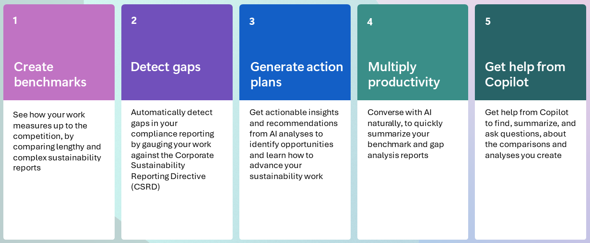
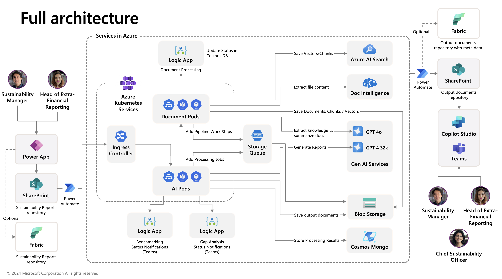

# Comparative Analysis for Sustainability

MENU: [**USER STORY**](#user-story) \| [**QUICK DEPLOY**](#quick-deploy) \| [**SUPPORTING DOCUMENTS**](#supporting-documents)

<h2 id="user-story">
 
User story
</h2>

**Solution accelerator overview**

This solution accelerator enables companies to detect compliance gaps, benchmark against their peers, and generate action plans to ensure they’re on track to meet their sustainability goals. Leveraging the simplicity of PowerApps, users can easily upload documents and generate gap analyses and benchmarking reports for CSRD (Corporate Social Responsibility Directive) indicators. An AI-generated report is then created, which provides a brief summary of the company’s (and their peer’s) performance, similarities/dissimilarities, and an action plan for improvement. The user can also use natural language with a Teams Copilot to ask questions about the reports to further aid understanding and actionability.

**Scenarios**

As a sustainability manager or sustainability analyst, you will be able to use the solution to perform below business functions:  

- Analyze your company's suitability document and obtain insights and recommendations to help your corporation to identify gaps and take actions to achieve set suitability goals. 
- Compare your sustainability document with your peers' sustainability documents and obtain benchmark and gap analysis reports. In most of the cases, you will be able to download your peers' sustainability documents from their public facing websites. 
 

**Key features** 
Below diagram illustrates the key features of this solution accelerator. 

 

**Solution Accelerator Landing Page**

Below is a sample landing page of the solution accelerator after it is deployed, set up, and ready to be used. You will need to replace Microsoft Logo with your own company's logo. 

<h2 id="quick-deploy">
 
Quick deploy
</h2>

### **How to install/deploy**

Please click this [**Link to Deployment Guide**]( ./Deployment/README.md) for instructions on how to deploy and set up the solution accelerator. Additionally, review the [Power Platform Client Readme.md](./Client/README.md) for client app usage instructions.

### Solution accelerator architecture

Below is the architecture of this solution accelerator. Please read the **notes** below the diagram before you decide to deploy the demonstration solution to your environment. Please refer to [Architecture Description](./Deployment/docs/ArchitectureDescription.md) for description of the architecture and additional information. 

 > **Note 1**: Please note that **the provided code serves as a demonstration only**. The solution is **not an officially supported Microsoft offering**.
 >
 > **Note 2**: Before deploying the solution accelerator, **please read** [Security.md](./Deployment/docs/Security.md) for security information. 
 >
 > **Note 3**: Some features contained in this repository are in private preview. Certain features might not be supported or might have constrained capabilities. For more information, see [Supplemental Terms of Use for Microsoft Azure Previews](https://azure.microsoft.com/en-us/support/legal/preview-supplemental-terms).

### Important Notes on Branding 

We used Microsoft as a sample company with Microsoft sustainability data to illustrate a more realistic experience. You will need to replace Microsoft Logo in user interface with your own company logo, replace Microsoft Sustainability data with your own sustainability data, and perform comparative analysis against your own peers' sustainability data in your industry, which may be available to the public for download. 

Third-parties are not authorized to use Microsoft company branding for their own purposes. 

### Prerequisites

To use this solution accelerator, you will need access to an [Azure subscription](https://azure.microsoft.com/free/) with permission to create resource groups and resources. You will also need to have Power Platform License to deploy the sample Power Platform Client Solution.  A prior understanding of Microsoft Copilot Studio, Microsoft Power Power Platform, Azure Open AI, Azure AI Search, Azure AI Document Intelligence will be helpful.

For additional training and support, please see:

1. [Microsoft Power Platform](https://learn.microsoft.com/en-us/power-platform/)
2. [Microsoft Copilot Studio](https://learn.microsoft.com/en-us/microsoft-copilot-studio/)
3. [Microsoft SharePoint](https://learn.microsoft.com/en-us/sharepoint/)
4. [Azure Blob Storage](https://learn.microsoft.com/en-us/azure/storage/blobs/)
5. [Azure Queue storage](https://learn.microsoft.com/en-us/azure/storage/queues/)
6. [Azure Open AI](https://learn.microsoft.com/en-us/azure/ai-services/openai/) 
7. [Azure AI Search](https://learn.microsoft.com/en-us/azure/search/)
8. [Azure AI Document Intelligence](https://learn.microsoft.com/en-us/azure/ai-services/document-intelligence/?view=doc-intel-4.0.0)
9. [Azure Cosmos DB](https://learn.microsoft.com/en-us/azure/cosmos-db/)
10. [Azure Logic Apps](https://learn.microsoft.com/en-us/azure/logic-apps/)
11. [Azure Container Registry](https://learn.microsoft.com/en-us/azure/container-registry/)
12. [Azure Kubernetes Service (AKS)](https://learn.microsoft.com/en-us/azure/aks/)

<h2 id="supporting-documents">
 
Supporting Documents
</h2>

Please review the item 3 on  [**Client README**]( ./Client/README.md)  on document size limitations and step 4 of [**Deployment Guide**]( ./Deployment/README.md) on how you can refine the AI prompts to meet your specific implementation requirements.

## Responsible AI Transparency FAQ 

Please refer to [Transparency FAQ](./TRANSPARENCY_FAQ.md) for responsible AI transparency details of this solution accelerator.

## Disclaimers

This release is an artificial intelligence (AI) system that generates text based on user input. The text generated by this system may include ungrounded content, meaning that it is not verified by any reliable source or based on any factual data. The data included in this release is synthetic, meaning that it is artificially created by the system and may contain factual errors or inconsistencies. Users of this release are responsible for determining the accuracy, validity, and suitability of any content generated by the system for their intended purposes. Users should not rely on the system output as a source of truth or as a substitute for human judgment or expertise. 

This release only supports English language input and output. Users should not attempt to use the system with any other language or format. The system output may not be compatible with any translation tools or services, and may lose its meaning or coherence if translated. 

This release does not reflect the opinions, views, or values of Microsoft Corporation or any of its affiliates, subsidiaries, or partners. The system output is solely based on the system's own logic and algorithms, and does not represent any endorsement, recommendation, or advice from Microsoft or any other entity. Microsoft disclaims any liability or responsibility for any damages, losses, or harms arising from the use of this release or its output by any user or third party. 

This release does not provide any financial advice, and is not designed to replace the role of qualified client advisors in appropriately advising clients. Users should not use the system output for any financial decisions or transactions, and should consult with a professional financial advisor before taking any action based on the system output. Microsoft is not a financial institution or a fiduciary, and does not offer any financial products or services through this release or its output. 

This release is intended as a proof of concept only, and is not a finished or polished product. It is not intended for commercial use or distribution, and is subject to change or discontinuation without notice. Any planned deployment of this release or its output should include comprehensive testing and evaluation to ensure it is fit for purpose and meets the user's requirements and expectations. Microsoft does not guarantee the quality, performance, reliability, or availability of this release or its output, and does not provide any warranty or support for it. 

This Software requires the use of third-party components which are governed by separate proprietary or open-source licenses as identified below, and you must comply with the terms of each applicable license in order to use the Software. You acknowledge and agree that this license does not grant you a license or other right to use any such third-party proprietary or open-source components.  

To the extent that the Software includes components or code used in or derived from Microsoft products or services, including without limitation Microsoft Azure Services (collectively, “Microsoft Products and Services”), you must also comply with the Product Terms applicable to such Microsoft Products and Services. You acknowledge and agree that the license governing the Software does not grant you a license or other right to use Microsoft Products and Services. Nothing in the license or this ReadMe file will serve to supersede, amend, terminate or modify any terms in the Product Terms for any Microsoft Products and Services. 

You must also comply with all domestic and international export laws and regulations that apply to the Software, which include restrictions on destinations, end users, and end use. For further information on export restrictions, visit https://aka.ms/exporting. 

You acknowledge that the Software and Microsoft Products and Services (1) are not designed, intended or made available as a medical device(s), and (2) are not designed or intended to be a substitute for professional medical advice, diagnosis, treatment, or judgment and should not be used to replace or as a substitute for professional medical advice, diagnosis, treatment, or judgment. Customer is solely responsible for displaying and/or obtaining appropriate consents, warnings, disclaimers, and acknowledgements to end users of Customer’s implementation of the Online Services. 

You acknowledge the Software is not subject to SOC 1 and SOC 2 compliance audits. No Microsoft technology, nor any of its component technologies, including the Software, is intended or made available as a substitute for the professional advice, opinion, or judgement of a certified financial services professional. Do not use the Software to replace, substitute, or provide professional financial advice or judgment.  

BY ACCESSING OR USING THE SOFTWARE, YOU ACKNOWLEDGE THAT THE SOFTWARE IS NOT DESIGNED OR INTENDED TO SUPPORT ANY USE IN WHICH A SERVICE INTERRUPTION, DEFECT, ERROR, OR OTHER FAILURE OF THE SOFTWARE COULD RESULT IN THE DEATH OR SERIOUS BODILY INJURY OF ANY PERSON OR IN PHYSICAL OR ENVIRONMENTAL DAMAGE (COLLECTIVELY, “HIGH-RISK USE”), AND THAT YOU WILL ENSURE THAT, IN THE EVENT OF ANY INTERRUPTION, DEFECT, ERROR, OR OTHER FAILURE OF THE SOFTWARE, THE SAFETY OF PEOPLE, PROPERTY, AND THE ENVIRONMENT ARE NOT REDUCED BELOW A LEVEL THAT IS REASONABLY, APPROPRIATE, AND LEGAL, WHETHER IN GENERAL OR IN A SPECIFIC INDUSTRY. BY ACCESSING THE SOFTWARE, YOU FURTHER ACKNOWLEDGE THAT YOUR HIGH-RISK USE OF THE SOFTWARE IS AT YOUR OWN RISK.  