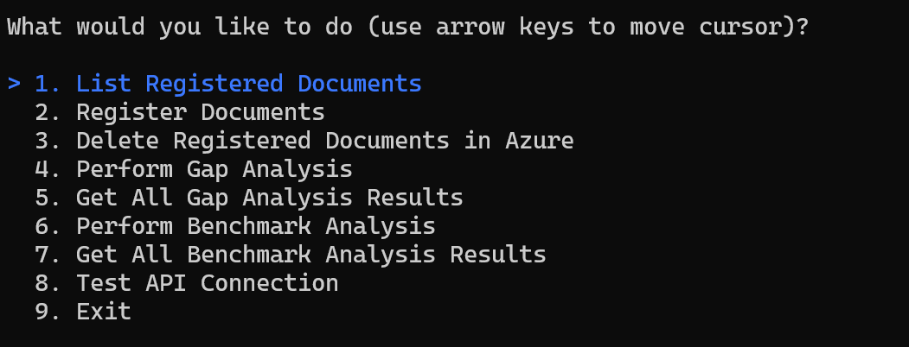
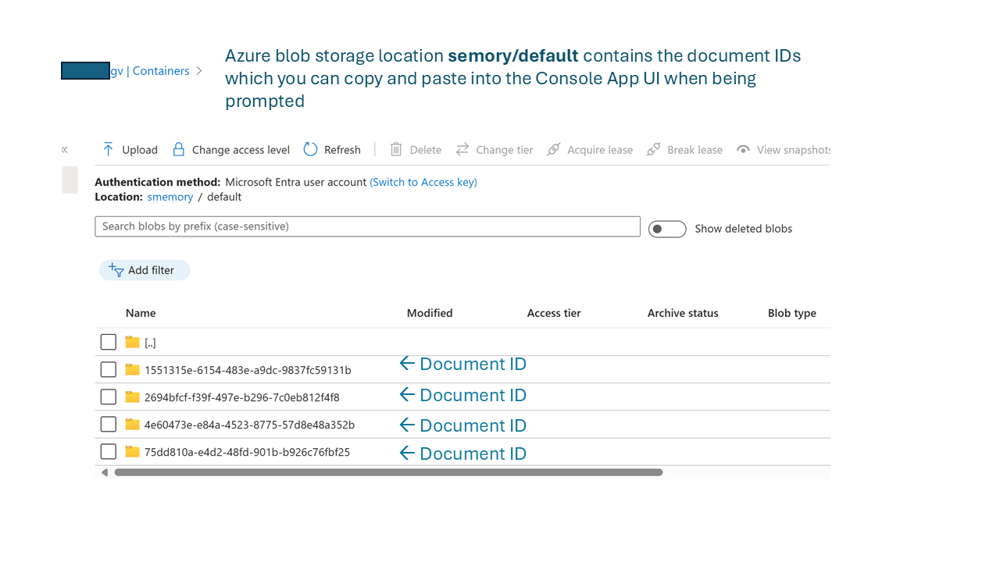

# Test App to check on Azure Services 
This .NET C# Console app was developed using .NET 8 and Visual Studio 2022. You can use either Visual Studio or Visual Studio Code to open the `Tester-App.sln` to build and run the Console App. 

The app user interface summarizes the functions of this app: 

## Steps to set up the app and then test

**Step 1**: Use Visual Studio or Visual Studio Code to open the `Tester-App.sln`.

**Step 2**: Use the format of `sample_appsettings.json` to create your `appsettings.json` in the root folder, and replace the value of `UrlString` with the actual API URL of the Azure services you deployed using the [deployAzureResources.ps1](https://github.com/microsoft/Comparative-Analysis-for-Sustainability-Solution-Accelerator/blob/gri-prompt/Deployment/scripts/deployAzureResources.ps1). 

For your connivence, a working `appconfig.json` is created for you, ready to be used. It has one set of values for GRI and another for CSRD. Later, you can replace with different values in  the `Disclosure Details.xslx` located in the `Client` directory of this solution accelerator. 

**Step 3**: Build and run the .NET C# solution. Use your keyboard down and up arrow keys to select the function to test .

Please note that you will need to register documents first before you can perform gap analysis or benchmark analysis. Once the documents are registered, you can find the document IDs in the azure storage account you deployed with your backend azure resources, as illustrated in below figure. **You will be asked to provide document IDs when performing gap analysis or benchmark analysis.** 

